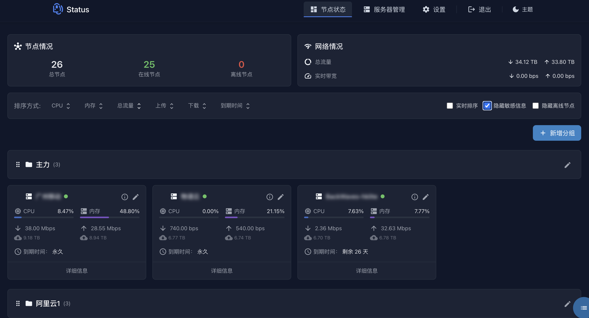
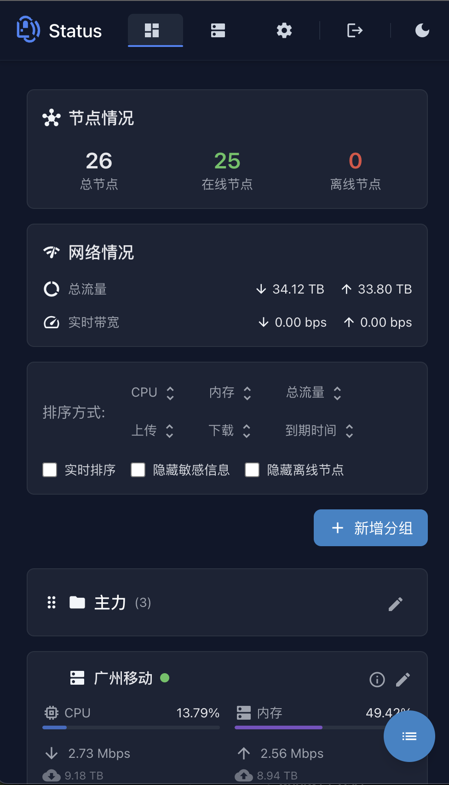

# DStatus

<div align="center">
    
    <p>一个现代化的服务器状态监控面板</p>
</div>

## 功能特点

- 🖥️ 服务器监控: CPU、内存、网络实时监控
- 📊 数据统计: 流量统计、历史数据记录
- 👥 分组管理: 灵活的服务器分组
- 🔔 通知提醒: Telegram Bot 通知
- 🎨 界面美观: 响应式设计,暗色主题


## 📸 界面预览

<div align="center">
    <table>
        <tr>
            <td align="center">
                <strong>🌙 暗黑模式</strong><br/>
                
            </td>
        </tr>
        <tr>
            <td align="center">
                <strong>📱 移动端视图</strong><br/>
                
            </td>
        </tr>
    </table>
</div>

## 快速开始

### 方式一: Docker Run

```bash
# 拉取镜像
docker pull ghcr.io/fev125/dstatus:latest

# 创建数据目录
mkdir -p /root/dstatus/{database,logs}

# 运行容器
docker run -d \
  --name dstatus \
  -p 5555:5555 \
  -v /root/dstatus/database:/app/database \
  -v /root/dstatus/logs:/app/logs \
  -e TZ=Asia/Shanghai \
  ghcr.io/fev125/dstatus:latest
```

### 方式二: Docker Compose

1. 下载配置文件
```bash
wget https://raw.githubusercontent.com/fev125/dstatus/main/docker-compose.yml
```

2. 启动服务
```bash
docker-compose up -d
```

### 访问管理面板

- 访问地址: `http://your-ip:5555`
- 默认密码: `dstatus`
- 首次登录后请立即修改密码

## 环境变量

- `WEB_PORT`: Web管理界面端口(默认5555)
- `TZ`: 时区设置(默认Asia/Shanghai)
- `NODE_ENV`: 运行环境(建议production)

## 数据目录

```
dstatus/
├── database/     # 数据文件
│   └── db.db     # SQLite数据库
└── logs/         # 日志文件
```

## 常用命令

```bash
# 查看日志
docker logs -f dstatus

# 重启服务
docker restart dstatus

# 停止服务
docker stop dstatus

# 更新服务
docker stop datatus && dookcer rm dstatus 

# 再次运行容器
docker run -d \
  --name dstatus \
  -p 5555:5555 \
  -v /root/dstatus/database:/app/database \
  -v /root/dstatus/logs:/app/logs \
  -e TZ=Asia/Shanghai \
  ghcr.io/fev125/dstatus:latest
```

# 删除服务
docker rm dstatus
```

## 安全建议

1. 修改默认密码
2. 使用反向代理并启用HTTPS
3. 定期备份数据


## 🙏 致谢

- 感谢 [NekoNekoStatus](https://github.com/nkeonkeo/nekonekostatus) 项目的启发
- 感谢所有贡献者的付出

